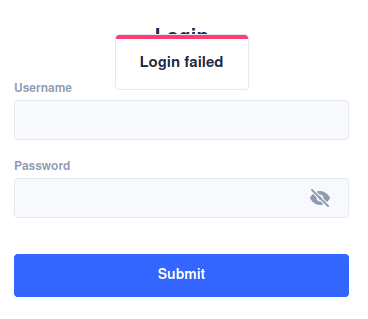

# ui-kitten-toast

Toasts in the style of ui-kitten for modern react-native applications.




## Install

```
yarn add ui-kitten-toast
```

## Usage

Add the `ToastProvider` in your app main file, but below ui-kittens `ApplicationProvider`!

```
<ApplicationProvider {...eva} theme={eva.light}>
    <ToastProvider>
        ...
    </ToastProvider>
</ApplicationProvider>
```

Use the `useToast` hook wherever you want to show a toast.

```
const { showToast } = useToast();

showToast({ status: 'danger', message: 'Some error :c' });

```

## API

- `status`: Any status that a ui-kitten `card` would accept.
- `message`: `string` or `ReactNode`.


**Be aware that this is a very early alpha. Feel free to contribute or suggest more features**
